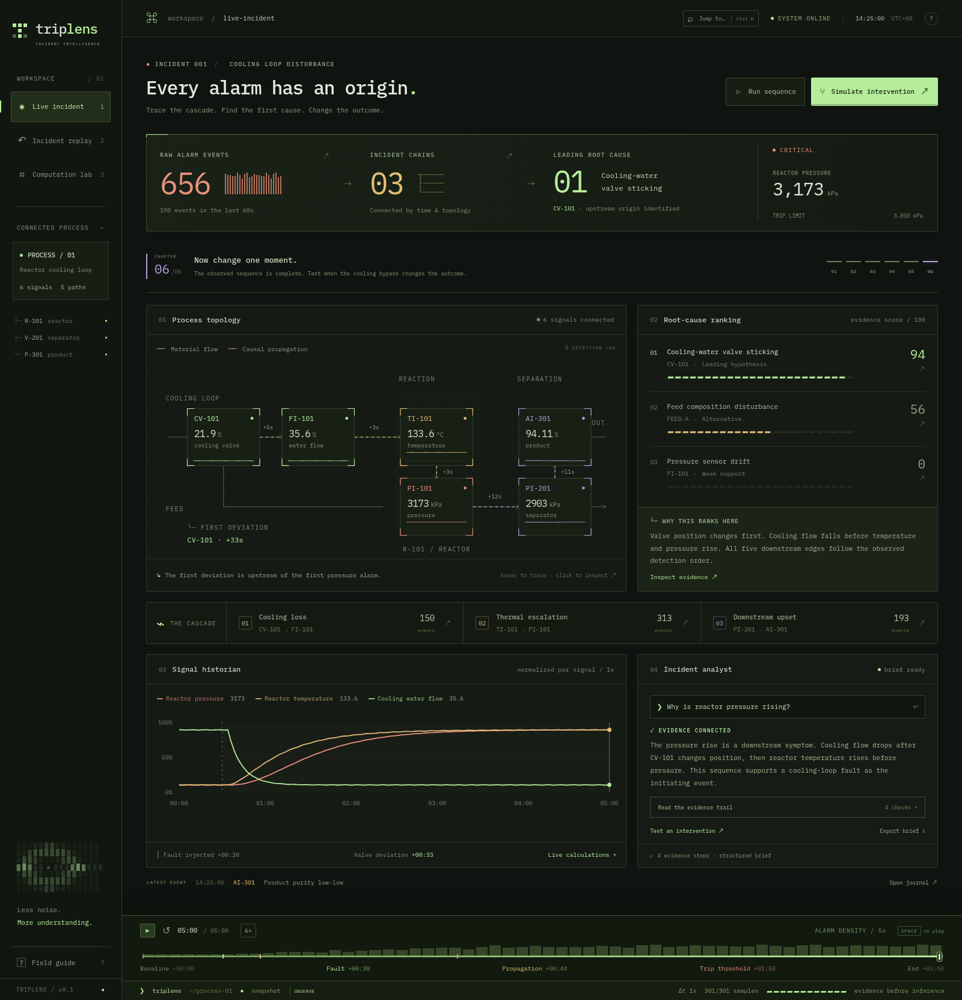

# TripLens

**Every alarm has an origin.** 从报警洪泛追溯第一故障的过程事故工作站。

[English](README.en.md) · [运行项目](#运行项目) · [模型接口](#模型接口)

TripLens 用现代 Web 技术呈现精致的终端视觉：字符图形、细线工艺拓扑、流动的传播路径、证据展开动画和可拖动的时间轴。浏览器就是工作站，不需要真正的终端 UI。



[计算实验室](docs/computation-lab.png) · [干预对比](docs/intervention.png) · [快捷命令](docs/command-palette.png)

## 已实现

- **事故工作站**：6 路过程信号、实时状态、报警计数、3 条传播链与根因候选。悬停或聚焦节点高亮上游路径，节点内展示最近 40 秒的趋势；点开查看完整信号，点开传播链追查所有原始报警。
- **完整演示流程**：`Run sequence` 从正常工况开始，经过六个可跳转章节，呈现冷却阀故障、偏离检测、证据连接、阈值越线和结构化调查。常驻播放条支持暂停、1× / 3× / 6× / 12×、跳转和重置，并显示每 5 秒的实际报警数量分布。
- **事故回放**：时间轴同步更新趋势、节点、报警和计算。回退到证据尚未出现的时刻会清除调查结果。
- **反事实比较**：相同初始状态，分别在 +90 / +120 / +150 秒打开独立冷却旁路并降低进料。轨迹逐步展开，突出压力峰值、与停机阈值的距离以及报警减少量。早干预能避开阈值，晚干预未必能。
- **可展开的调查依据**：调查完成后，展开 `Read the evidence trail` 逐条查看结构化证据与结论边界。
- **计算实验室**：Pearson 相关矩阵、传播时差和滞后相关、根因评分分解、六项可复现性检查。主界面可展开每路信号的 robust z、CUSUM 和每秒变化量。
- **证据导出**：事故简报 Markdown、原始报警 JSON、信号 JSON、干预轨迹 JSON 和完整计算 JSON。
- **模型边界**：本地证据和模型服务使用相同的结构化 JSON 协议；模型接入无需改写前端。
- **快捷命令**：`Ctrl/⌘ K` 搜索并跳转工作区、信号、章节或操作，支持方向键选择和回车执行；证据不足的操作自动禁用。
- **交互打磨**：键盘快捷键、模态框焦点管理、移动端布局、本地字体、减少动态效果偏好支持。

## 运行项目

需要 Node.js 20.19+ 或 22.12+，以及 npm。Python 3.10+ 仅用于重新计算数据、验证或运行可选服务端。

```bash
npm ci
npm run dev
```

打开终端给出的本地地址。默认无需后端、API 密钥或外部网络；计算产物已提交为 JSON，字体也随项目打包。

```bash
npm run generate  # 原生 Python 重新生成所有计算结果
npm run check     # Python 测试 + TypeScript 检查 + 生产构建
npm run preview  # 预览 dist，默认 4173 端口
```

也可以只用 Python 启动构建后的成品与 API：

```bash
npm run build
python3 server.py   # http://127.0.0.1:8787
```

前端演示路径：**Run sequence → Inspect evidence → Investigate incident → Simulate intervention → Computation lab**。可直接拖动时间轴；默认进入 +03:00 的事故快照以便立即查看。

快捷键：`Ctrl/⌘ K` 打开命令面板，`Space` 播放/暂停，`1/2/3` 切换工作区，`R` 重启序列，`?` 打开操作说明，`Esc` 关闭对话框。命令面板使用 `↑/↓` 选择、`Enter` 执行；时间轴聚焦后可用方向键逐秒移动。

## 计算方法

`simulation/generate.py` 只用 Python 标准库，实际计算 301 个时刻的过程状态以及三条干预分支。

1. 阀位在 +30s 改变，冷却流量经过 5s 传输延迟进入一阶响应；温度、压力、分离器和产品纯度依次响应。
2. 正常段建立 median/MAD 基线。连续四个样本超过 6 倍鲁棒尺度才确认偏离；同步计算描述性 CUSUM 和差分。
3. 按阈值和重复提示间隔生成报警，并根据显式设备拓扑归入三条链。重复事件保留在原始日志中。
4. 评分使用信号方向、拓扑覆盖、时序匹配、无法解释的信号以及缺失反馈惩罚。评分不是概率，相关性也不是单独的因果证明。
5. 干预分支与原轨迹在干预前逐样本一致；故障阀保持卡住，独立旁路恢复冷却。

模型是本项目实现的**低阶过程模型**，并非完整 Tennessee Eastman 仿真器，也未连接真实工厂。当前检查针对一个故障场景和三个干预时机，不代表公开基准上的诊断准确率。阈值越线表示轨迹达到停机条件，当前模型没有加入实际停机后的控制动作。

完整计算得到 **656 个原始报警 → 3 条传播链**。检测顺序为 `CV-101 (+33s) → FI-101 (+38s) → TI-101 (+41s) → PI-101 (+44s) → PI-201 (+56s) → AI-301 (+67s)`。

| 轨迹 | 压力峰值 | 是否越过 3,050 kPa |
|---|---:|---|
| 原事故 | 3,174 kPa | 是 |
| +90s 干预 | 2,975 kPa | 否 |
| +120s 干预 | 3,072 kPa | 是 |
| +150s 干预 | 3,126 kPa | 是 |

## 模型接口

默认 `localAnalyst` 读取 Python 生成的结构化证据。目前本地调查仅支持界面给定的提问 `Why is reactor pressure rising?`。这里没有隐藏的云请求，也不会把本地输出标作实际模型推理。

`src/lib/engine.ts` 定义 `AnalystProvider` 和 `IncidentBrief`，`server.py` 提供兼容 Chat Completions 的薄适配器，无编排框架。接口为：

```http
POST /api/analyze
Content-Type: application/json

{"incidentId":"INC-001","prompt":"Why is reactor pressure rising?"}
```

响应包含 `schemaVersion`、`incidentId`、`provider`、`prompt`、`steps`、`summary`、`limitation`、`candidateId`、`evidenceTags`。模型只组织已计算证据，并返回 JSON；数值计算保留在过程模块。

开发时连接服务端（可以先不配模型，服务端仍使用本地计算）：

```bash
python3 server.py
# 另一个终端
VITE_ANALYST_PROVIDER=http npm run dev
```

接入兼容服务时，在 **Python 服务端环境** 设置以下变量。`.env.example` 仅作示例；Python 不会自动读取 `.env`。

```bash
export TRIPLENS_MODEL_ENDPOINT='https://your-provider/v1/chat/completions'
export TRIPLENS_MODEL='your-model-id'
export TRIPLENS_MODEL_API_KEY='your-secret'
python3 server.py
```

生产成品接 API 时先 `VITE_ANALYST_PROVIDER=http npm run build`，再运行 Python 服务端。密钥只在服务端，**不要放入任何 `VITE_` 变量**。模型响应经过前后端结构校验；网络失败会给出可重试错误。真实模型服务尚未接通验证；适配器通过本地 HTTP fixture 测试。

## 结构与取舍

```text
src/
  App.tsx                 工作区、播放状态、调查流程
  components/             工艺图、趋势、计算面板、时间轴、检查器
  lib/engine.ts           数据查询、结构化分析接口、导出
  data/scenario.json      可重建的数值产物
  styles.css              终端设计系统、动效、响应式布局
simulation/
  generate.py             过程模拟、检测、评分与数值诊断
  test_model.py           数值和产物一致性检查
  test_api.py             loopback API / 模型适配器验证
server.py                 可选的标准库 API 与静态服务器
```

React + TypeScript + Vite + Motion + Tailwind CSS；原生 Python + JSON。没有 Docker、数据库、LangChain、ML 框架或 3D 引擎。工艺拓扑和图表使用 SVG，数字、字符和过渡动画留在浏览器中。

MIT License.
