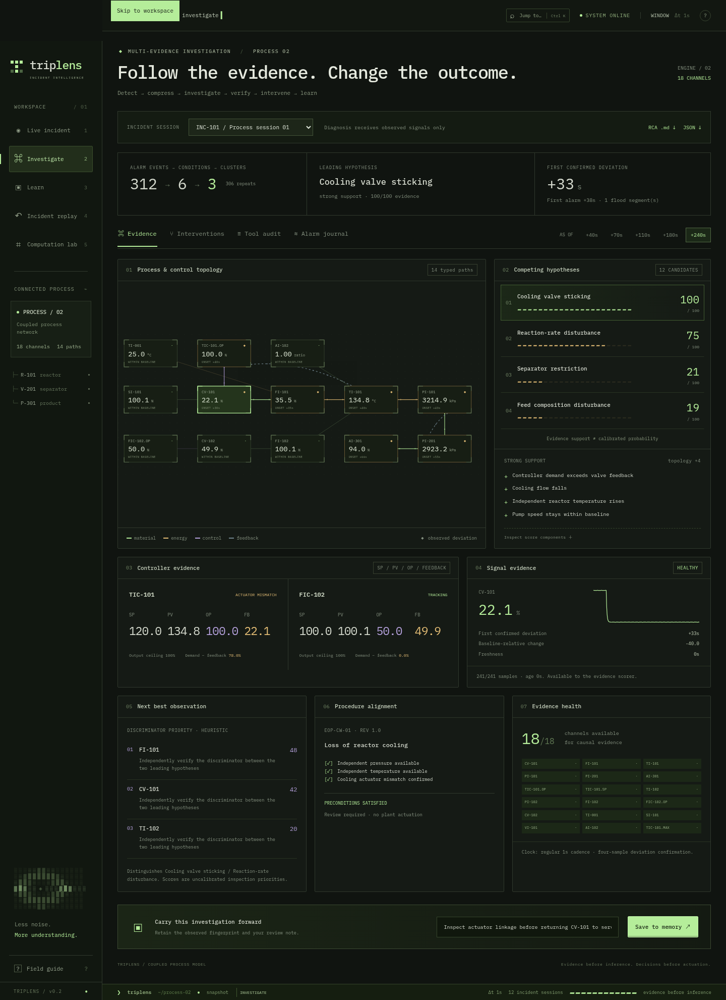

# TripLens

**Follow the evidence. Change the outcome.** 面向连续过程工业的事故调查与决策工作站。

[English](README.en.md) · [运行项目](#运行项目) · [项目视频 · 2:50](video/README.md) · [计算与边界](#计算与边界) · [调整说明](docs/adjustment-notes.md)

TripLens 在浏览器里呈现现代终端风格：字符动画、细线拓扑、流动的传播路径、可展开的证据，以及真正由数值计算支撑的干预搜索。核心闭环为 **Detect → Compress → Investigate → Verify → Intervene → Learn**。



[恢复窗口搜索](docs/recovery-v2.png) · [历史与验证](docs/learn-v2.png) · [原事故回放](docs/workstation.png)

## 当前能力

- **INVESTIGATE**：12 个事故会话，18 路观测通道，14 条物料、能量、控制和反馈路径。诊断只接收观测记录，不接收场景标签；候选包含支持、反证、未决证据、权重分解和下一步检查建议。
- **过程与控制分离**：两套控制回路显示 SP / PV / OP / actuator feedback / output limit；独立温度、压力通道帮助区分过程变化和传感器故障。冻结、缺失、过时和异常跳变数据不能直接获得强因果证据分。
- **时间边界**：+40 / 70 / 110 / 180 / 240 秒快照分别用当时已有样本重新分析。早期快照不会显示完整窗口的反事实结果或历史相似度。
- **干预搜索**：旁路、降进料、备用泵、调整设定点、紧急冷却、受控停机和组合动作。每个会话拟合领先假设后，计算 **1,547 条分支**，逐秒枚举 +20…240 秒，保留所有安全区间、最后可恢复时间、压力裕度、产量损失、质量损失和额外冷却消耗。界面可拖动起始时间，查看成功和失败分支。
- **报警压缩**：分别统计激活、重复提示、恢复事件、唯一条件和过程分组；显示洪泛区间、持续/短暂/抖动条件和完整可筛选日志。整治建议保留独立安全报警，不能直接执行抑制。
- **调查审计**：结构化工具输入与数值输出可展开检查。使用本地确定性调查策略，保留模型输出结构化工具请求的接口。
- **LEARN**：观测指纹相似会话、报警整治建议、36 个参数变体的内部验证矩阵；完成的调查和操作员备注可保存在本浏览器的 JSON 存储中并导出。
- **CSV 回放分析**：导入时间有序的通道数据，执行同一套盲诊断、质量检查、报警分析和工具审计；缺少的通道明确保留为未决证据。导入需要本机 Python 服务。
- **RCA 档案**：Markdown / JSON 导出包含事故摘要、检测与报警时间、控制器、传播路径、候选正反证、反事实、规程前置条件、历史相似度、健康状态及开放问题。
- **LIVE / REPLAY / LAB**：保留原有冷却阀事故的逐秒播放、章节跳转、信号检查器、相关矩阵、CUSUM 和演示流程。此工作区使用原来的六通道模型，和新增 PROCESS 02 的两控制回路模型分别计算。

## 运行项目

需要 Node.js 20.19+ 或 22.12+、npm；Python 3.10+ 用于重新计算、测试和可选服务端。无额外 Python 包。

```bash
npm ci
npm run dev
```

默认打开 INVESTIGATE。静态应用不需要 API 密钥或外部网络，数值产物和字体已随项目提供。

```bash
npm run generate  # 重新计算两个模型、12 个会话及验证矩阵
npm run check     # Python 测试、TypeScript 检查与生产构建
npm run preview   # 静态预览，默认 4173 端口
```

完整运行，包括 CSV 导入：

```bash
npm run build
python3 server.py   # http://127.0.0.1:8787
```

开发时可同时启动 `python3 server.py` 和 `npm run dev`；Vite 将 `/api` 转发到本机 8787 端口。

浏览路径：**Investigate → 切换会话/观测时刻 → Interventions → Tool audit → Alarm journal → Save to memory → Learn**。原来的完整动画通过 **Live incident → Run sequence** 播放。

快捷键：`Ctrl/⌘ K` 命令面板；`1/2/3/4/5` 切换 Live / Investigate / Learn / Replay / Lab；`Space` 在 Live / Replay 播放或暂停；`R` 打开 Live 并重播；`?` 操作说明；`Esc` 关闭对话框。

## 计算与边界

`simulation/platform.py` 使用 Python 标准库实现耦合低阶过程模型：控制输出限幅和变化率限制、执行器响应、传输延迟、冷却、进料、热惯性、压力、分离器与反馈。物理压力与测量压力分别计算，单个压力传感器误报不等于真实压力越线。

故障覆盖：冷却阀卡滞、进料阀卡滞、冷却水退化、进料组分扰动、反应速率扰动、泵退化、分离器受限、压力偏置、温度漂移、压力冻结、控制输出上限变化、控制回路振荡。参数支持严重度、起始时刻、传输延迟、噪声、控制器响应、工况与种子。

检测以输入窗口前 20 个稳定样本建立 median/MAD 基线，加入工程尺度下限，连续四个样本偏离 6 倍尺度才确认。该基线在窗口内固定，不是自适应滚动基线。评分由带符号的工程证据和小幅拓扑项构成，**不是校准概率**。下一观测的优先级为可解释启发式，不是已校准的信息价值。

反事实不读取场景真值：先从观测窗口诊断，再对领先故障的严重度和起始时间做网格拟合。所有干预在该拟合模型上计算，干预前与拟合模型轨迹一致。安全表示 **240 秒模型窗口内物理压力未越过 3,050 kPa**，不是无限时间保证，也不是可直接控制工厂的建议。三项推荐分别比较每种动作自身最后安全时刻的裕度、产量损失和可恢复时间；不存在单一未经说明的“最优”总分。

当前 PROCESS 02 冷却阀会话产生 **312 个事件 → 6 个条件 → 3 个过程分组**。拟合模型未干预时在 +109 秒越线；冷却旁路最后安全启动时刻为 **+101 秒**，紧急冷却为 **+103 秒**。控制方式不同，因此这些数值不应与 PROCESS 01 的 656 事件模型混用。

内部验证覆盖 **12 类 × 3 组参数 = 36 个故障窗口**及 3 个正常窗口；当前 Top-1 / Top-3 为 36/36，中位检测延迟 3 秒，正常窗口误报 0/3。这是同一模拟器上的规则回归，**不代表独立数据集准确率**。未运行 Tennessee Eastman 基准，未接真实工厂。MQTT / OPC UA、通用自然语言 SOP 导入、真实 Nemotron 调度及独立公开基准仍待接入。

## 数据与模型接口

CSV 首列为秒单位时间戳 `t`；其他列使用 `src/lib/platform.ts` 对应的信号键。界面可下载完整示例。要求 25–2,000 行，其中前 20 行为稳定基线；空白信号值作为缺失，重复或倒退时间戳、非有限数值、未知列会被拒绝。

```http
POST /api/replay
Content-Type: application/json

{"csv":"t,valve,flow,...\n..."}
```

结构化工具边界不需要编排框架：

```http
POST /api/investigate
Content-Type: application/json

{"rows":[...],"calls":[{"tool":"inspect_signal_window","args":{"signal":"valve"}},{"tool":"compare_hypotheses","args":{}}]}
```

允许 1–16 个已知工具请求；当前支持 signal window、change point、controller、downstream path、alarm history、hypothesis comparison、SOP alignment、next measurement。除窗口检查的 `signal` 参数外，其余工具使用空参数对象。省略 `calls` 使用默认调查策略。接口只返回观测数据计算结果；模型不能覆盖物理值或传入故障标签。

原六通道调查保留 `POST /api/analyze` 和兼容 Chat Completions 的服务端适配器。默认读取本地结构化证据；实际模型服务仍未配置。接入时在 Python 服务端环境设置：

```bash
export TRIPLENS_MODEL_ENDPOINT='https://your-provider/v1/chat/completions'
export TRIPLENS_MODEL='your-model-id'
export TRIPLENS_MODEL_API_KEY='your-secret'
python3 server.py
# 另一个终端：VITE_ANALYST_PROVIDER=http npm run dev
```

`.env.example` 仅作示例，Python 不自动读取它。密钥只留在服务端，不能使用 `VITE_` 变量。模型适配器已通过 loopback fixture 验证，未声称真实 Nebius / NVIDIA 调用。

## 项目结构

```text
src/components/PlatformWorkspace.tsx  多事故调查、干预、报警与学习界面
src/components/platform.css           新工作区的终端视觉与响应式布局
src/lib/platform.ts                   数据协议、RCA 导出和浏览器事故记忆
src/data/platform.json                可重建的会话、反事实和验证产物
simulation/platform.py                盲诊断、双控制回路、搜索与工具边界
simulation/test_platform.py           时间边界、数据质量、物理分支与盲诊断验证
simulation/generate.py                原六通道事故模型
server.py                             标准库 HTTP、CSV 与模型接口
```

React + TypeScript + Vite + Motion + Tailwind CSS；原生 Python + JSON。无 Docker、数据库、LangChain、ML 框架或 3D 引擎。

MIT License.
